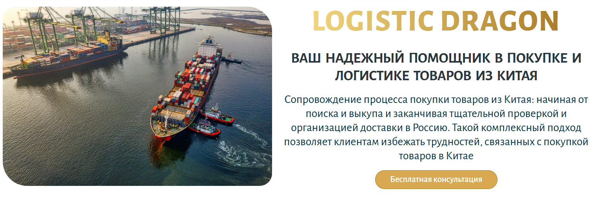
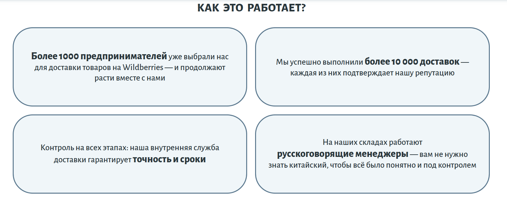
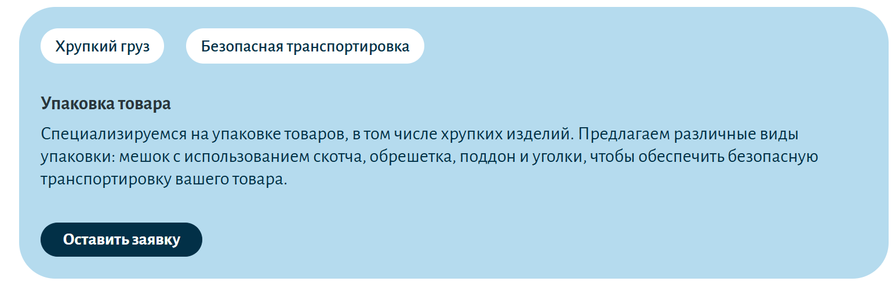
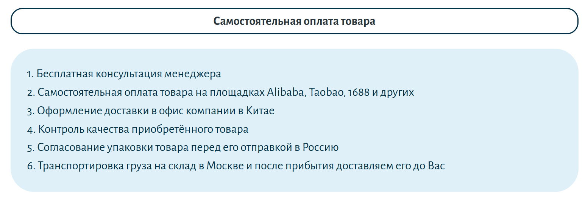
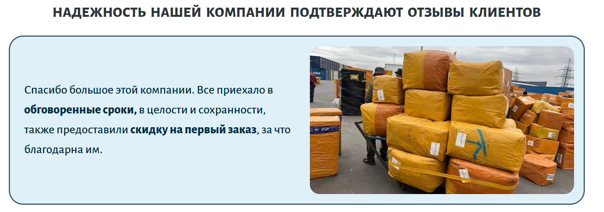
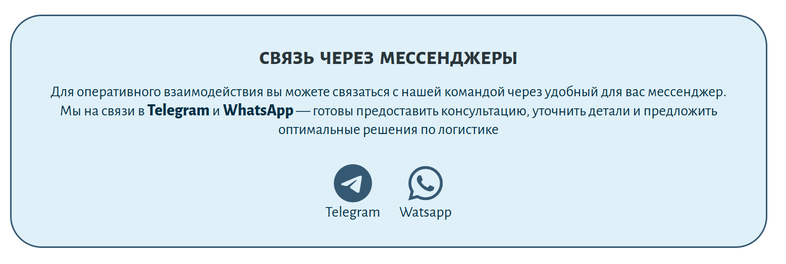

# Logistic Dragon — сайт-визитка логистической компании

## Описание проекта
Одностраничный адаптивный сайт-визитка для логистической компании Logistic Dragon. Сайт содержит основные разделы: "Главная", "О нас", "Услуги", "Этапы работы", "Отзывы", "Контакты". Реализовано бургер-меню для мобильных устройств. 

## Стек технологий
- Figma
- HTML5
- CSS3 (без фреймворков)
- Адаптивная верстка (Flexbox, Grid, Media Queries)

## Функциональность
+ Одностраничный макет
+ Адаптивная верстка для всех устройств
+ hover-эффекты для кнопок, ссылок
+ Бургер-меню
+ Секции: Главная, О нас, Услуги, Этапы работы, Отзывы, Контакты
+ Хостинг с доменом

## Скриншоты
Дизайн разработан мной лично и первоначально реализован в Figma. Цветовая палитра и шрифты были также выбраны мной лично, отталкивалась от логотипа компании.

На скриншоте представлено меню с основными разделами сайта:

На скриншоте представлен главный раздел сайта:

На скриншоте представлен раздел "О нас", в котором описаны главные преимущества компании

На скриншоте представлен раздел "Услуги", в котором в виде карточек описаны основные услуги компании

На скриншоте представлен раздел "Этапы работы"

На скриншоте представлен раздел "Отзывы", оформлен в виде карточек с фотографией

На скриншоте представлен заключающий раздел сайта "Контакты"

## Демо
[Перейти на сайт](https://logisticdragon.ru)

